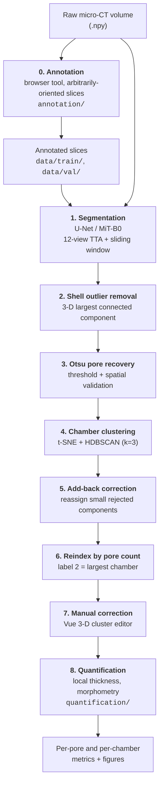

# foram-porosity-pipeline

End-to-end pipeline for **annotating, segmenting, clustering, correcting and quantifying pore structure in foraminifera micro-CT volumes**.

Accepted at **ECCV 2026 Workshop CVNH**. This repository contains the whole workflow: the browser-based annotation tool that produced the training data, the deep-learning segmentation model, the machine-learning post-analysis that resolves individual chambers, an interactive 3-D correction interface, and the morphometric quantification that produces the paper's numbers and figures.

## Contents

- [Pipeline overview](#pipeline-overview)
- [Repository layout](#repository-layout)
- [Installation](#installation)
- [Data formats](#data-formats) — [what ships here](#what-ships-in-this-repository) · [slice annotations](#slice-annotations--rgb-encoding) · [volume labels](#volume-labels--integer-encoding) · [editor state](#editor-state-files) · [large data](#large-data-distributed-separately)
- [Running the pipeline](#running-the-pipeline) — [0 annotation](#stage-0--annotation) · [1 segmentation](#stage-1--segmentation) · [2–6 post-analysis](#stages-26--automated-post-analysis) · [7 correction](#stage-7--manual-correction) · [8 quantification](#stage-8--quantification)
- [The segmentation model](#the-segmentation-model)
- [Citation and sources](#citation)

---

## Pipeline overview



Stage 0 is how the training set was built. Stages 1–6 are automated, stage 7 is a human-in-the-loop review UI, and stage 8 produces the measurements and figures reported in the paper. The section headings under [Running the pipeline](#running-the-pipeline) use these same stage numbers.

---

## Repository layout

```
annotation/                              Stage 0 — slice annotation interface
    app.py                               NiceGUI server; --port / --host
    annotator.py  slicer.py              Painting canvas; arbitrary-orientation slice extraction
    utils.py  volumedata.py              I/O, palette, volume handling
analysis/                                Stages 1–7
    model.py  trainer.py  loader.py      Segmentation model, training loop, dataset
    adaptive_loss.py  metrics.py         Class-wise Tversky loss, Dice/IoU metrics
    predict.py                           12-view TTA sliding-window volume inference
    cli/train_cli.py  cli/predict_cli.py Command-line entry points
    post_processing/                     Stages 2–7, in pipeline order
        remove_outliers.py               Stage 2 — largest-connected-component cleanup
        clean_pores.py                   Stage 3 — Otsu pore recovery
        prototype_tsne.py                Stage 4 — t-SNE + HDBSCAN chamber clustering
        add_back_forams.py               Stage 5 — add-back of rejected components
        organize_addback_outputs.py      Stage 5 → 6 — sorts add-back output into the expected tree
        reindex_clusters.py              Stage 6 — relabel chambers by pore count
        prepare_editor_data.py           Builds editor state from clustering output
        cluster_editor_vue.py            Stage 7 — interactive 3-D correction interface
    evaluation/                          Method evaluation, off the main path
        analyze_otsu_pore_recovery.py    Ablation of the Otsu recovery step
        chamber_volume_estimate.py       Per-chamber volume, three assignment methods compared
    visualization/                       Viewers and renders
        visualize_prediction.py          Overlay renders of predictions
        show_image_slices.py             PNG previews of slices through a volume
        view_image_volume_python.py      Matplotlib slice viewer for a raw .npy volume
        visualize_image_volume_3d.py     Headless Plotly 3-D view of a raw volume
quantification/                          Stage 8 — morphometry and figures
    run_all_quantification.py            Per-chamber and per-pore metrics from label volumes
    config.py                            Central paths, overridable by environment variables
    figures/                             Local-thickness 3-D, pore morphometry, chamber figures
data/                                    Annotated slices and results — see Data formats
```

---

## Installation

```bash
git clone https://github.com/<your-username>/foram-porosity-pipeline.git
cd foram-porosity-pipeline
python -m venv .venv && source .venv/bin/activate
pip install -r requirements.txt
```

Python 3.12 is the tested version, and one `requirements.txt` covers every stage. A CUDA GPU is required for training and strongly recommended for volume inference, since 12-view TTA is compute-heavy; annotation, post-processing and quantification are CPU-only.

For stage 0 alone, the annotator needs only `nicegui`, `opencv-python`, `numpy`, `scipy`, `scikit-image` and `Pillow` — no `torch`.

---

## Data formats

### What ships in this repository

About 43 MB:

| Path | Contents |
|---|---|
| `data/train/` | 171 annotated slices — `images/`, `masks/`, `weights/` |
| `data/val/` | 40 annotated slices — `images/`, `masks/`, `weights/` |
| `data/results/summary_tsv/` | Add-back assignment records, one row per recovered pore, 122 forams |
| `data/results/summary_npz/` | The same records, machine-readable |
| `data/samples/editor_state/` | 2 sample volumes for trying the correction interface |

Slices are `768 × 768` deflate-compressed TIFF. Compression is **lossless** — `skimage.io.imread` returns arrays byte-identical to the uncompressed originals.

### Slice annotations — RGB encoding

Applies to the 2-D `masks/` TIFFs. Three classes plus an ignore region:

| Colour | RGB | Class |
|---|---|---|
| Red | `(230, 25, 75)` | 0 — Background |
| Yellow | `(255, 225, 25)` | 1 — Chamber (shell wall) |
| Green | `(60, 180, 75)` | 2 — Pores |
| Black | `(0, 0, 0)` | *unannotated* — excluded from the loss |

The paired `weights/` maps are binary: `255` where the annotation is valid, `0` over unannotated regions. The loss is masked by this map, so black areas never contribute a gradient. Roughly a third of the current dataset is deliberately left unannotated — partial annotation is the intended way to work.

`analysis/utils.py` decodes these colours through `CLASS_COLORS`, the single source of truth for the encoding; change it there if you change the palette. Note the **brush order in the annotator is red, green, yellow**, so its second brush is pores and its third is chamber. Only the RGB value written into the mask matters downstream, never the brush index.

### Volume labels — integer encoding

Applies to the 3-D `.npy` volumes the pipeline produces, and is unrelated to the RGB scheme above:

| Value | Meaning |
|---|---|
| `0` | Background (air/resin outside the foram) |
| `1` | Shell material |
| `2` | Chamber with the **most** pore voxels |
| `3` | Chamber with the second most |
| `N` | Chamber ranked N−1 by pore count |

That ranking is what stage 6 establishes, so `2` means the same thing in every volume. Output of stages 2–3 is the exception: it uses only `{0, 1, 2}`, all pore voxels sharing label `2`, because chambers are not resolved yet. That undifferentiated form is what the editor opens; the chamber-labelled form is what quantification consumes.

### Editor state files

Stage 7 input, `.npz`, two samples in `data/samples/editor_state/`:

| Key | Contents |
|---|---|
| `centroids_3d` | `(P, 3)` centroid of each pore component |
| `labels` | `(P,)` chamber assignment per pore: `>=2` chamber, `0` deleted |
| `labeled_pores` | Full 3-D volume, each pore component uniquely labelled |
| `shell_mask` | Binary shell mask |
| `volume_path` | Path to the corresponding `{0,1,2}` volume |
| `pore_voxels`, `pore_voxels_owner` | Sampled pore voxels and their pore index, for 3-D rendering |
| `chamber_voxels` | Sampled shell voxels, for context rendering |

The editor reconstructs chamber assignments from `labels`, not from the volume it opens.

### Large data distributed separately

Full micro-CT volumes (23 GB), labelled volumes (63 GB) and the complete set of 122 editor states are too large for Git. The **trained model checkpoint** is attached to the [GitHub Release](../../releases/latest):

```bash
mkdir -p final_model
curl -L -o final_model/model_Unet_mitb0_newTversky.ckpt \
  https://github.com/<your-username>/foram-porosity-pipeline/releases/latest/download/model_Unet_mitb0_newTversky.ckpt
```

---

## Running the pipeline

### Stage 0 — Annotation

The browser tool that produced `data/train/` and `data/val/`. It cuts arbitrarily-oriented 2-D slices from the 3-D volumes and writes the image/mask/weight triples `analysis/loader.py` consumes.

```bash
# run from the directory containing data/image_volumes/*.npy
cd /path/to/project
python /path/to/repo/annotation/app.py --port 9546
```

| Option | Default | Purpose |
|---|---|---|
| `--port` | `9546` | Serving port. Change it if the default is taken, or to run several at once. |
| `--host` | `127.0.0.1` | Interface to bind. Localhost-only by default. |

Data paths resolve against the **working directory**, so launch it from wherever your `data/` lives. There is deliberately no `--data-dir`: nicegui re-executes the program on every page request, and changing the working directory at startup breaks that re-execution.

Open <http://localhost:9546>. It binds to localhost only, so reach it over an SSH tunnel (`ssh -N -L 9546:localhost:9546 <user>@<host>`) or your editor's port forwarding. `--host 0.0.0.0` exposes it on the network, but the tool is unauthenticated and writes files, so avoid that on a machine with a public address.

**Workflow.** A random slice is cut from a random volume at a random orientation; paint each class, leaving anything you are unsure about unpainted; **Save Annotation** writes the files; **Resample** for the next slice. Sampling can be Random, Axially-aligned, Custom (explicit origin and rotation vector) or Replicate (re-cut a previously saved slice).

| Input | Action |
|---|---|
| Left drag | Paint with the current class |
| Right drag | Paint with class 0 (background) |
| Shift + left drag | Pan the view |
| Mouse wheel | Brush size |
| Shift + mouse wheel | Zoom in / out |
| `c` / `v` | Next / previous class colour |
| `q` / `a` | Step the slice forwards / backwards through the volume |
| `Ctrl+Z` / `Ctrl+Y` | Undo / redo |
| `Ctrl+S` | Save annotation |

**Output** goes to `data/train/`, paired by sorted filename: `images/<NAME>.tiff` (`uint8` grayscale), `masks/<NAME>.tiff` (RGB colour-coded), `weights/<NAME>.tiff` (`255` annotated / `0` ignore), `slices/<NAME>.npy` (slice geometry, for exact re-cutting) and `configs/<NAME>.json` (human-readable geometry record).

Adapted from the upstream `interactive_unet` tool with its model training, inference and live-suggestion code removed, since `analysis/` already provides that.

### Stage 1 — Segmentation

**Training.**

```bash
python analysis/cli/train_cli.py                       # defaults reproduce the paper model
python analysis/cli/train_cli.py --architecture UnetPlusPlus --encoder resnet34 --epochs 100
```

Key options: `--epochs --batch-size --learning-rate --architecture --encoder --loss {tversky,adaptive,mcc_ce} --tversky-alpha --scheduler {cosine,plateau,onecycle} --train-dir --val-dir`.

**Inference.**

```bash
# whole directory of volumes
python analysis/cli/predict_cli.py --model final_model/model_Unet_mitb0_newTversky.ckpt \
    --input data/image_volumes --input-size 768

# single volume
python analysis/cli/predict_cli.py --model final_model/model_Unet_mitb0_newTversky.ckpt \
    --input data/image_volumes/MOM_12_01.npy
```

Inference predicts along all three orthogonal axes at four rotations — 12 views — and soft-votes the averaged probabilities, which suppresses view-dependent false positives and improves 3-D connectivity.

### Stages 2–6 — Automated post-analysis

```bash
# 2 — remove shell outliers
python analysis/post_processing/remove_outliers.py --pred pred.npy --out cleaned.npy

# 3 — Otsu pore recovery
python analysis/post_processing/clean_pores.py cleaned.npy pores_cleaned.npy

# 4 — t-SNE + HDBSCAN chamber clustering
python analysis/post_processing/prototype_tsne.py pores_cleaned.npy cluster_state.npz

# 5 — add back small rejected components
python analysis/post_processing/add_back_forams.py pores_cleaned.npy cluster_state.npz \
    --outdir corrected/ --min-voxels 20 --knn-k 3 --write-corrected-volume

# 6 — reindex chambers by descending pore count
python analysis/post_processing/reindex_clusters.py --in-dir corrected/ --out-dir final_state/
```

Chamber clustering embeds morphological pore features with t-SNE and groups them with HDBSCAN; components HDBSCAN rejects as noise are reassigned to their nearest cluster by centroid proximity.

### Stage 7 — Manual correction

```bash
# build editor state from a volume + clustering result
python analysis/post_processing/prepare_editor_data.py volume.npy cluster_state.npz editor_state/

# launch the interface (try it on the bundled samples)
python analysis/post_processing/cluster_editor_vue.py data/samples/editor_state --port 5005
```

Open <http://localhost:5005>. Pick a volume from the dropdown, paint the pores that need changing, apply **Merge** or **Split**, repeat until the chamber labels are right, then **Save**.

| Input | Action |
|---|---|
| Left drag | Rotate the camera |
| Right drag | Pan |
| Mouse wheel | Zoom |
| `Select` / `Eraser` mode | Add pores to / remove pores from the selection |
| Shift + mouse wheel | Brush radius |
| Shift + left drag | Rotate while in Select/Eraser mode |
| Double-click a chamber row | Solo that chamber; double-click again to restore |
| `Ctrl+Z` | Undo |
| `Esc` | Close the help modal, otherwise return to Navigate mode |

**Merge** combines the chambers of the selected pores, or every visible chamber if nothing is selected — so set visibility before merging to avoid pulling in chambers you cannot see. **Split** makes a new chamber from the selection.

Saving writes four things under a `manual_review/` folder beside the state directory: `corrected_volume/<name>.npy`, a reloadable `editor_state/<name>.npz`, and `summary_npz/` plus `summary_tsv/` records. The session then switches to the saved state, so continuing to edit builds on your correction instead of overwriting the pipeline's original.

The frontend vendors three.js, Vue and TrackballControls in `analysis/post_processing/static/` so the interface runs fully offline on a compute node.

### Stage 8 — Quantification

Turns the finished label volumes into per-pore, per-chamber and whole-shell measurements plus the paper's figures.

**Inputs.** Paths live in [`quantification/config.py`](quantification/config.py) and are all overridable by environment variable, so no code edits are needed:

| Input | Environment variable | Contents |
|---|---|---|
| Label volumes, `*.npy` | `FORAM_VOL_DIR` | One 3-D `uint8` volume per specimen, in the [integer encoding](#volume-labels--integer-encoding) above |
| `Ni et al info.xlsx` | `FORAM_NI_INFO` | Voxel sizes; columns `CT file name` and `resolution nm` |
| `chamber_ordering.xlsx` | `FORAM_ORDER_XLSX` | Whorl ordering of chambers, needed only for the chamber-wise figures |

Outputs go to `FORAM_QUANT_DIR` and `FORAM_FIG_DIR`. Anything unset falls back to `quantification/data/` and `quantification/output/`, both created automatically and both git-ignored — supply your own inputs there or point the variables elsewhere.

**Running.**

```bash
cd quantification

python run_all_quantification.py            # 1. per-chamber + per-pore CSV/Excel, LT arrays
python figures/pore_morphometry.py          # 2. per-pore shape table
python figures/pore_and_chamber_figures.py  # 3. morphometry + chamber-wise figures
python figures/local_thickness_3d.py --sample MOM_12_01   # 4. interactive 3-D report
```

`run_all_quantification.py` is resume-safe and caches local-thickness arrays, so an interrupted run picks up where it stopped.

**Outputs.**

| File | Contents |
|---|---|
| `chamber_summary.csv` | One row per chamber: pore count, mean pore volume, mean local thickness, sphericity, elongation/flatness |
| `all_pores.csv` | One row per pore: volume, surface area, sphericity, elongation/flatness, local-thickness stats |
| `quantification_all_samples.xlsx` | The two tables above as a workbook |
| `pore_morphometry.csv` | Per-pore chamber, voxel count, elongation, flatness |
| `pore_shape.png/.pdf`, `chamber_metrics.png/.pdf` | Pore-shape panels; per-chamber trends along the last whorl with bootstrap CIs |
| `thickness_3d_report.html` | Interactive 3-D local-thickness scenes for one specimen |

**Method notes.** Local thickness follows Hildebrand & Rüegsegger (1997) — the diameter of the largest sphere fitting inside the structure at each voxel — computed with SciPy distance transforms. Zingg (1935) shape uses `Elongation = sqrt(λ1/λ2)` and `Flatness = sqrt(λ2/λ3)` from the pore's covariance eigenvalues; the square root converts variance ratios into axis-**length** ratios, since variance scales as length², so the `1.5` class boundary matches Zingg's classic 3:2.

| | elongation ≤ 1.5 | elongation > 1.5 |
|---|---|---|
| **flatness > 1.5** | oblate (disk) | triaxial |
| **flatness ≤ 1.5** | isotropic (equant) | prolate (rod) |

---

## The segmentation model

| | |
|---|---|
| Architecture | U-Net, `mit_b0` (Mix Vision Transformer) encoder |
| Pretrained weights | ImageNet |
| Classes | Background / Chamber / Pores |
| Loss | Class-wise Tversky — pores use α=0.3, β=0.7 to favour recall |
| Schedule | 200 epochs, batch size 16, cosine |

**Validation performance:** Pores Dice **0.607**, Pores IoU **0.436**, overall Dice **0.835**.

Pores are thin, sparse and ambiguous at CT resolution, so the loss is deliberately recall-biased for that class. Stages 3 and 5 then restore missed pore voxels, and stage 7 resolves the residual errors.

---

## Citation

```bibtex
@inproceedings{wu2026foram,
  title     = {A Pipeline for Chamber-Resolved Analysis of Pore Traits in Foraminiferal {\textmu}CT Volumes},
  author    = {Wu, Hanqing and others},
  booktitle = {Proceedings of the European Conference on Computer Vision (ECCV) Workshops (CVNH)},
  year      = {2026}
}
```

## Micro-CT data source

The foraminifera μCT volumes are from Ni et al. (2025), openly archived on Mendeley Data and not redistributed here:

- Ni, S., Müter, D., Charrieau, L. M., Pirzamanbein, B., Choquel, C., Knudsen, K. L., et al. (2025). Morphological insights from benthic foraminifera for environmental conditions in the Baltic Sea during the last interglacial. *Paleoceanography and Paleoclimatology*, 40, e2024PA005063. https://doi.org/10.1029/2024PA005063
- 3D micro-CT morphology data [Dataset]. Mendeley Data, V1. https://doi.org/10.17632/9fztrjc2d5.1
- 3D SRμCT scans [Dataset]. Mendeley Data, V1. https://doi.org/10.17632/7s7kgppzgz.1

## Method references

- Zingg, Th. (1935). *Beitrag zur Schotteranalyse.* PhD thesis, ETH Zürich.
- Blott, S. J. & Pye, K. (2008). Particle shape: a review and new methods of characterization and classification. *Sedimentology* 55, 31–63.
- Hildebrand, T. & Rüegsegger, P. (1997). A new method for the model-independent assessment of thickness in three-dimensional images. *J. Microsc.* 185, 67–75.

## License

Released under the MIT License — see [LICENSE](LICENSE).

Vendored frontend libraries in `analysis/post_processing/static/` retain their own licenses (three.js — MIT; Vue — MIT).
