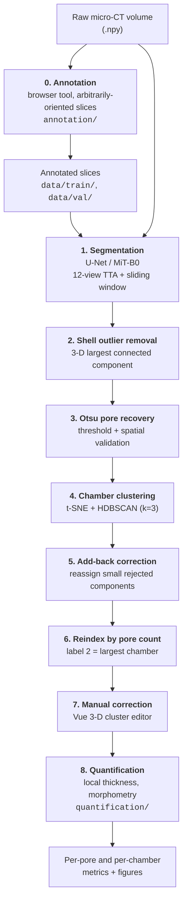

# foram-porosity-pipeline

End-to-end pipeline for **annotating, segmenting, clustering, correcting and quantifying pore structure in foraminifera micro-CT volumes**.

Accepted at **ECCV 2026 Workshop CVNH**. This repository contains the whole workflow: the browser-based annotation tool that produced the training data, the deep-learning segmentation model, the machine-learning post-analysis that resolves individual chambers, an interactive 3-D correction interface, and the morphometric quantification that produces the paper's numbers and figures.

---

## Pipeline overview



Stage 0 is how the training set was built; stages 1–6 are automated; stage 7 is a human-in-the-loop review UI; stage 8 produces the measurements and figures reported in the paper.

---

## Repository layout

```
annotation/                              Stage 0 — slice annotation interface
    app.py                               NiceGUI server; --port / --host
    annotator.py  slicer.py              Painting canvas; arbitrary-orientation slice extraction
    utils.py  volumedata.py              I/O, palette, volume handling
src/
    model.py  trainer.py  loader.py      Segmentation model, training loop, dataset
    adaptive_loss.py  metrics.py         Class-wise Tversky loss, Dice/IoU metrics
    predict.py                           12-view TTA sliding-window volume inference
    cli/train_cli.py  cli/predict_cli.py Command-line entry points
    post_processing/
        remove_outliers.py               Stage 2 — largest-connected-component cleanup
        clean_pores.py                   Stage 3 — Otsu pore recovery
        prototype_tsne.py                Stage 4 — t-SNE + HDBSCAN chamber clustering
        add_back_forams.py               Stage 5 — add-back of rejected components
        prepare_editor_data.py           Builds editor state from clustering output
        cluster_editor_vue.py            Stage 7 — interactive 3-D correction interface
        visualize_prediction.py          Overlay renders of predictions
scripts/analysis/
    reindex_clusters.py                  Stage 6 — relabel chambers by pore count
    quantification.py                    Earlier per-chamber quantification (superseded by quantification/)
    chamber_volume_estimate.py           Per-chamber volume estimation
    analyze_otsu_pore_recovery.py        Ablation of the Otsu recovery step
    calculate_stats.py                   Outlier-removal statistics from cleaning logs
    view_image_volume_python.py          Matplotlib slice viewer for a raw .npy volume
    visualize_image_volume_3d.py         Headless Plotly 3-D view of a raw volume
    serve_html_folder.py                 Serves generated HTML, prints SSH forwarding commands
quantification/                          Stage 8 — morphometry and figures
    run_all_quantification.py            Per-chamber and per-pore metrics from label volumes
    config.py                            Central paths, overridable by environment variables
    figures/                             Local-thickness 3-D, pore morphometry, chamber figures
docs/                                    Volume label format, cluster editor manual
data/                                    Training slices + results (see Data below)
```

---

## Installation

```bash
git clone https://github.com/<your-username>/foram-porosity-pipeline.git
cd foram-porosity-pipeline
python -m venv .venv && source .venv/bin/activate
pip install -r requirements.txt
```

Python 3.12 is the tested version. A single `requirements.txt` covers every stage. A CUDA GPU is required for training and strongly recommended for volume inference (12-view TTA is compute-heavy); annotation, post-processing and quantification are CPU-only.

The annotator alone needs just `nicegui`, `opencv-python`, `numpy`, `scipy`, `scikit-image` and `Pillow` — no `torch` — if you want a minimal install for stage 0 only.

---

## Data

### Included in this repository (~43 MB)

| Path | Contents |
|---|---|
| `data/train/` | 171 annotated slices — `images/`, `masks/`, `weights/` |
| `data/val/` | 40 annotated slices — `images/`, `masks/`, `weights/` |
| `data/results/summary_tsv/` | Add-back assignment records — one row per recovered pore, 122 forams |
| `data/results/summary_npz/` | The same records, machine-readable |
| `data/samples/editor_state/` | 2 sample volumes for trying the correction interface |

Slices are `768 × 768` deflate-compressed TIFF. Compression is **lossless** — `skimage.io.imread` returns arrays byte-identical to the uncompressed originals.

### Annotation encoding

Masks are RGB colour-coded with three classes plus an ignore region:

| Colour | RGB | Class |
|---|---|---|
| Red | `(230, 25, 75)` | 0 — Background |
| Yellow | `(255, 225, 25)` | 1 — Chamber (shell wall) |
| Green | `(60, 180, 75)` | 2 — Pores |
| Black | `(0, 0, 0)` | *unannotated* — excluded from the loss |

The paired `weights/` maps are binary: `255` where the annotation is valid, `0` over unannotated regions. The loss is masked by this map, so black areas never contribute a gradient — roughly a third of the current dataset is deliberately left unannotated, and partial annotation is the intended way to work. `src/utils.py` decodes the colours through `CLASS_COLORS`, which is the single source of truth for the encoding; change it there if you change the palette.

Note the **brush order in the annotator is red, green, yellow**, so its second brush is pores and its third is chamber. Only the RGB value written into the mask matters downstream, never the brush index.

### Distributed separately

Full micro-CT volumes (23 GB), labelled/clustered volumes (63 GB) and the complete set of 122 editor states are too large for Git. The **trained model checkpoint** is attached to the [GitHub Release](../../releases/latest):

```bash
mkdir -p final_model
curl -L -o final_model/model_Unet_mitb0_newTversky.ckpt \
  https://github.com/<your-username>/foram-porosity-pipeline/releases/latest/download/model_Unet_mitb0_newTversky.ckpt
```

Volume-level label encoding is documented in [`docs/DATA_FORMAT.md`](docs/DATA_FORMAT.md).

---

## Usage

### 0. Annotation

The browser tool that produced `data/train/` and `data/val/`. It cuts arbitrarily-oriented 2-D slices from the 3-D volumes and writes the image/mask/weight triples `src/loader.py` consumes.

```bash
# run from the directory containing data/image_volumes/*.npy
cd /path/to/project
python /path/to/repo/annotation/app.py --port 9600
```

| Option | Default | Purpose |
|---|---|---|
| `--port` | `9546` | Serving port. Change it if the default is taken, or to run several at once. |
| `--host` | `127.0.0.1` | Interface to bind. Localhost-only by default. |

Data paths resolve against the **working directory**, so launch it from wherever your `data/` lives. There is deliberately no `--data-dir`: nicegui re-executes the program on every page request, and changing the working directory at startup breaks that re-execution.

Open <http://localhost:9546>. It binds to localhost only, so reach it over an SSH tunnel (`ssh -N -L 9546:localhost:9546 <user>@<host>`) or your editor's port forwarding. `--host 0.0.0.0` exposes it on the network, but the tool is unauthenticated and writes files, so avoid that on a machine with a public address.

**Workflow.** A random slice is cut from a random volume at a random orientation; paint each class, leaving anything you are unsure about unpainted; **Save Annotation** writes the files; **Resample** for the next slice. Sampling can be Random, Axially-aligned, Custom (explicit origin and rotation vector) or Replicate (re-cut a previously saved slice).

**Controls.**

| Input | Action |
|---|---|
| Left drag | Paint with the current class |
| Right drag | Paint with class 0 (background) |
| Shift + left drag | Pan the view |
| Mouse wheel | Brush size |
| Shift + mouse wheel | Zoom in / out |
| `c` / `v` | Next / previous class colour |
| `q` / `a` | Step the slice forwards / backwards through the volume |
| `Ctrl+Z` / `Ctrl+Y` | Undo / redo |
| `Ctrl+S` | Save annotation |

**Output**, written to `data/train/` and paired by sorted filename: `images/<NAME>.tiff` (`uint8` grayscale), `masks/<NAME>.tiff` (RGB colour-coded), `weights/<NAME>.tiff` (`255` annotated / `0` ignore), `slices/<NAME>.npy` (slice geometry, for exact re-cutting) and `configs/<NAME>.json` (human-readable geometry record).

Adapted from the upstream `interactive_unet` tool with its model training, inference and live-suggestion code removed, since `src/` already provides that.

### 1. Training

```bash
python src/cli/train_cli.py                       # defaults reproduce the paper model
python src/cli/train_cli.py --architecture UnetPlusPlus --encoder resnet34 --epochs 100
```

Key options: `--epochs --batch-size --learning-rate --architecture --encoder --loss {tversky,adaptive,mcc_ce} --tversky-alpha --scheduler {cosine,plateau,onecycle} --train-dir --val-dir`.

### 2. Inference

```bash
# whole directory of volumes
python src/cli/predict_cli.py --model final_model/model_Unet_mitb0_newTversky.ckpt \
    --input data/image_volumes --input-size 768

# single volume
python src/cli/predict_cli.py --model final_model/model_Unet_mitb0_newTversky.ckpt \
    --input data/image_volumes/MOM_12_01.npy
```

Inference predicts along all three orthogonal axes at four rotations (12 views total) and soft-votes the averaged probabilities, which suppresses view-dependent false positives and improves 3-D connectivity.

### 3. Post-analysis (machine learning)

```bash
# Stage 2 — remove shell outliers
python src/post_processing/remove_outliers.py --pred pred.npy --out cleaned.npy

# Stage 3 — Otsu pore recovery
python src/post_processing/clean_pores.py cleaned.npy pores_cleaned.npy

# Stage 4 — t-SNE + HDBSCAN chamber clustering
python src/post_processing/prototype_tsne.py pores_cleaned.npy cluster_state.npz

# Stage 5 — add back small rejected components
python src/post_processing/add_back_forams.py pores_cleaned.npy cluster_state.npz \
    --outdir corrected/ --min-voxels 20 --knn-k 3 --write-corrected-volume

# Stage 6 — reindex chambers by descending pore count
python scripts/analysis/reindex_clusters.py --in-dir corrected/ --out-dir final_state/
```

Chamber clustering embeds morphological pore features with t-SNE and groups them with HDBSCAN; components HDBSCAN rejects as noise are reassigned to their nearest cluster by centroid proximity.

### 4. Correction interface

```bash
# build editor state from a volume + clustering result
python src/post_processing/prepare_editor_data.py volume.npy cluster_state.npz editor_state/

# launch the interface (try it on the bundled samples)
python src/post_processing/cluster_editor_vue.py data/samples/editor_state --port 5005
```

Open <http://localhost:5005>. Paint pores with the select/eraser brush, then **Merge** or **Split** chambers; `Ctrl+Z` undoes. Saving writes a corrected volume, a reloadable editor state, and per-volume summaries. Full manual: [`docs/CLUSTER_EDITOR_USER_MANUAL.md`](docs/CLUSTER_EDITOR_USER_MANUAL.md).

The frontend vendors three.js, Vue and TrackballControls in `src/post_processing/static/` so the interface runs fully offline on a compute node.

### 5. Quantification

Takes the finished label volumes and turns them into per-pore, per-chamber and whole-shell measurements plus the paper's figures. Input is one `.npy` per specimen, a 3-D `uint8` label volume with `0` background, `1` shell, `>=2` one label per chamber.

Paths live in [`quantification/config.py`](quantification/config.py) and can all be set by environment variable, so no code edits are needed:

```bash
export FORAM_VOL_DIR=/path/to/clustered_volume        # input label volumes (.npy)
export FORAM_NI_INFO="/path/to/Ni et al info.xlsx"    # voxel-size table
export FORAM_ORDER_XLSX=/path/to/chamber_ordering.xlsx
export FORAM_QUANT_DIR=/path/to/output/quantification
export FORAM_FIG_DIR=/path/to/output/figures
```

Anything unset falls back to `quantification/data/` and `quantification/output/`.

```bash
cd quantification

python run_all_quantification.py            # 1. per-chamber + per-pore CSV/Excel, LT arrays
python figures/pore_morphometry.py          # 2. per-pore shape table
python figures/pore_and_chamber_figures.py  # 3. morphometry + chamber-wise figures
python figures/local_thickness_3d.py --sample MOM_12_01   # 4. interactive 3-D report
```

| Output | Contents |
|---|---|
| `chamber_summary.csv` | One row per chamber: pore count, mean pore volume, mean local thickness, sphericity, elongation/flatness |
| `all_pores.csv` | One row per pore: volume, surface area, sphericity, elongation/flatness, local-thickness stats |
| `quantification_all_samples.xlsx` | The two tables above as a workbook |
| `pore_morphometry.csv` | Per-pore chamber, voxel count, elongation, flatness |
| `pore_shape.png/.pdf`, `chamber_metrics.png/.pdf` | Pore-shape panels; per-chamber trends along the last whorl with bootstrap CIs |
| `thickness_3d_report.html` | Interactive 3-D local-thickness scenes for one specimen |

**Method notes.** Local thickness follows Hildebrand & Rüegsegger (1997) — the diameter of the largest sphere fitting inside the structure at each voxel — computed with SciPy distance transforms. Zingg (1935) shape uses `Elongation = sqrt(λ1/λ2)` and `Flatness = sqrt(λ2/λ3)` from the pore's covariance eigenvalues; the square root converts variance ratios into axis-**length** ratios (variance scales as length²), so the `1.5` class boundary matches Zingg's classic 3:2.

| | elongation ≤ 1.5 | elongation > 1.5 |
|---|---|---|
| **flatness > 1.5** | oblate (disk) | triaxial |
| **flatness ≤ 1.5** | isotropic (equant) | prolate (rod) |

`run_all_quantification.py` is resume-safe and caches local-thickness arrays. The earlier `scripts/analysis/quantification.py` remains for reference but is superseded by this package.

---

## Model

| | |
|---|---|
| Architecture | U-Net, `mit_b0` (Mix Vision Transformer) encoder |
| Pretrained weights | ImageNet |
| Classes | Background / Chamber / Pores |
| Loss | Class-wise Tversky — pores use α=0.3, β=0.7 to favour recall |
| Schedule | 200 epochs, batch size 16, cosine |

**Validation performance:** Pores Dice **0.607**, Pores IoU **0.436**, overall Dice **0.835**.

Pores are thin, sparse and ambiguous at CT resolution, so the loss is deliberately recall-biased for that class — the Otsu recovery and add-back stages then restore missed pore voxels, and the correction interface resolves the residual errors.

---

## Citation

```bibtex
@inproceedings{wu2026foram,
  title     = {A Pipeline for Chamber-Resolved Analysis of Pore Traits in Foraminiferal {\textmu}CT Volumes},
  author    = {Wu, Hanqing and others},
  booktitle = {Proceedings of the European Conference on Computer Vision (ECCV) Workshops (CVNH)},
  year      = {2026}
}
```

## Data source

The foraminifera μCT volumes are from Ni et al. (2025), openly archived on Mendeley Data and not redistributed here:

- Ni, S., Müter, D., Charrieau, L. M., Pirzamanbein, B., Choquel, C., Knudsen, K. L., et al. (2025). Morphological insights from benthic foraminifera for environmental conditions in the Baltic Sea during the last interglacial. *Paleoceanography and Paleoclimatology*, 40, e2024PA005063. https://doi.org/10.1029/2024PA005063
- 3D micro-CT morphology data [Dataset]. Mendeley Data, V1. https://doi.org/10.17632/9fztrjc2d5.1
- 3D SRμCT scans [Dataset]. Mendeley Data, V1. https://doi.org/10.17632/7s7kgppzgz.1

## References

- Zingg, Th. (1935). *Beitrag zur Schotteranalyse.* PhD thesis, ETH Zürich.
- Blott, S. J. & Pye, K. (2008). Particle shape: a review and new methods of characterization and classification. *Sedimentology* 55, 31–63.
- Hildebrand, T. & Rüegsegger, P. (1997). A new method for the model-independent assessment of thickness in three-dimensional images. *J. Microsc.* 185, 67–75.

## License

Released under the MIT License — see [LICENSE](LICENSE).

Vendored frontend libraries in `src/post_processing/static/` retain their own licenses (three.js — MIT; Vue — MIT).
