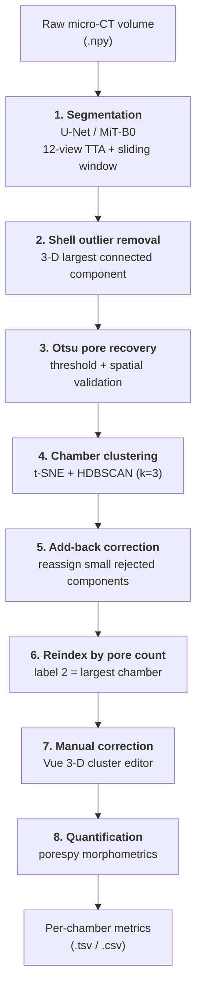

# foram-porosity-pipeline

End-to-end pipeline for **segmenting, clustering, correcting and quantifying pore structure in foraminifera micro-CT volumes**.

Accepted at an **ECCV workshop**. This repository contains the full analysis pipeline: the deep-learning segmentation model, the machine-learning post-analysis that resolves individual chambers, an interactive 3-D correction interface, and the morphometric quantification stage.

---

## Pipeline overview



Stages 1–6 are automated; stage 7 is a human-in-the-loop review UI; stage 8 produces the numbers used in the paper.

---

## Repository layout

```
src/
  model.py  trainer.py  loader.py        Segmentation model, training loop, dataset
  adaptive_loss.py  metrics.py           Class-wise Tversky loss, Dice/IoU metrics
  predict.py                             12-view TTA sliding-window volume inference
  cli/train_cli.py  cli/predict_cli.py   Command-line entry points
  post_processing/
    remove_outliers.py                   Stage 2 — largest-connected-component cleanup
    clean_pores.py                       Stage 3 — Otsu pore recovery
    prototype_tsne.py                    Stage 4 — t-SNE + HDBSCAN chamber clustering
    add_back_forams.py                   Stage 5 — add-back of rejected components
    prepare_editor_data.py               Builds editor state from clustering output
    cluster_editor_vue.py                Stage 7 — interactive 3-D correction interface
    visualize_prediction.py              Overlay renders of predictions
scripts/analysis/
    reindex_clusters.py                  Stage 6 — relabel chambers by pore count
    quantification.py                    Stage 8 — porespy morphometrics
    chamber_volume_estimate.py           Per-chamber volume estimation
    analyze_otsu_pore_recovery.py        Ablation of the Otsu recovery step
    ...                                  Statistics and visualisation helpers
notebooks/                               Quantification notebooks (see docs/)
docs/                                    Data format, editor manual, quantification notes
data/                                    Training slices + results (see Data below)
annotation/                              Annotation interface (to be added)
```

---

## Installation

```bash
git clone https://github.com/<your-username>/foram-porosity-pipeline.git
cd foram-porosity-pipeline
python -m venv .venv && source .venv/bin/activate
pip install -r requirements.txt
```

Python 3.12 is the tested version. A CUDA GPU is required for training and strongly recommended for volume inference (12-view TTA is compute-heavy); all post-processing and quantification stages are CPU-only.

---

## Data

### Included in this repository (~43 MB)

| Path | Contents |
|---|---|
| `data/train/` | 171 annotated slices — `images/`, `masks/`, `weights/` |
| `data/val/` | 40 annotated slices — `images/`, `masks/`, `weights/` |
| `data/results/summary_tsv/` | Per-chamber quantification output, 122 forams |
| `data/results/summary_npz/` | Same, machine-readable |
| `data/samples/editor_state/` | 2 sample volumes for trying the correction interface |

Slices are `768 × 768` deflate-compressed TIFF. Compression is **lossless** — `skimage.io.imread` returns arrays byte-identical to the uncompressed originals.

**Annotation encoding.** Masks are RGB colour-coded with three classes plus an ignore region:

| Colour | RGB | Class |
|---|---|---|
| Red | `(230, 25, 75)` | 0 — Background |
| Yellow | `(255, 225, 25)` | 1 — Chamber |
| Green | `(60, 180, 75)` | 2 — Pores |
| Black | `(0, 0, 0)` | *unannotated* — excluded from the loss |

The paired `weights/` maps are binary: `255` where the annotation is valid, `0` over unannotated regions. The loss is masked by this map, so black areas never contribute a gradient. `src/loader.py` converts colour masks to class indices via `utils.colored_to_categorical`.

### Distributed separately

Full micro-CT volumes (23 GB), labelled/clustered volumes (63 GB) and the complete set of 122 editor states are too large for Git. The **trained model checkpoint** is attached to the [GitHub Release](../../releases/latest):

```bash
mkdir -p final_model
curl -L -o final_model/model_Unet_mitb0_newTversky.ckpt \
  https://github.com/<your-username>/foram-porosity-pipeline/releases/latest/download/model_Unet_mitb0_newTversky.ckpt
```

Volume-level label encoding is documented in [`docs/DATA_FORMAT.md`](docs/DATA_FORMAT.md).

---

## Usage

### 1. Training

```bash
python src/cli/train_cli.py                       # defaults reproduce the paper model
python src/cli/train_cli.py --architecture UnetPlusPlus --encoder resnet34 --epochs 100
```

Key options: `--epochs --batch-size --learning-rate --architecture --encoder --loss {tversky,adaptive,mcc_ce} --tversky-alpha --scheduler {cosine,plateau,onecycle} --train-dir --val-dir`.

### 2. Inference

```bash
# whole directory of volumes
python src/cli/predict_cli.py --model final_model/model_Unet_mitb0_newTversky.ckpt \
    --input data/image_volumes --input-size 768

# single volume
python src/cli/predict_cli.py --model final_model/model_Unet_mitb0_newTversky.ckpt \
    --input data/image_volumes/MOM_12_01.npy
```

Inference predicts along all three orthogonal axes at four rotations (12 views total) and soft-votes the averaged probabilities, which suppresses view-dependent false positives and improves 3-D connectivity.

### 3. Post-analysis (machine learning)

```bash
# Stage 2 — remove shell outliers
python src/post_processing/remove_outliers.py --pred pred.npy --out cleaned.npy

# Stage 3 — Otsu pore recovery
python src/post_processing/clean_pores.py cleaned.npy pores_cleaned.npy

# Stage 4 — t-SNE + HDBSCAN chamber clustering
python src/post_processing/prototype_tsne.py pores_cleaned.npy cluster_state.npz

# Stage 5 — add back small rejected components
python src/post_processing/add_back_forams.py pores_cleaned.npy cluster_state.npz \
    --outdir corrected/ --min-voxels 20 --knn-k 3 --write-corrected-volume

# Stage 6 — reindex chambers by descending pore count
python scripts/analysis/reindex_clusters.py --in-dir corrected/ --out-dir final_state/
```

Chamber clustering embeds morphological pore features with t-SNE and groups them with HDBSCAN; components HDBSCAN rejects as noise are reassigned to their nearest cluster by centroid proximity.

### 4. Correction interface

```bash
# build editor state from a volume + clustering result
python src/post_processing/prepare_editor_data.py volume.npy cluster_state.npz editor_state/

# launch the interface (try it on the bundled samples)
python src/post_processing/cluster_editor_vue.py data/samples/editor_state --port 5005
```

Open <http://localhost:5005>. Paint pores with the select/eraser brush, then **Merge** or **Split** chambers; `Ctrl+Z` undoes. Saving writes a corrected volume, a reloadable editor state, and per-volume summaries. Full manual: [`docs/CLUSTER_EDITOR_USER_MANUAL.md`](docs/CLUSTER_EDITOR_USER_MANUAL.md).

The frontend vendors three.js, Vue and TrackballControls in `src/post_processing/static/` so the interface runs fully offline on a compute node.

### 5. Quantification

```bash
python scripts/analysis/quantification.py --data-dir final_state/clustered_volume \
    --out-dir data/analysis/quantification
```

Computes per-chamber porosity, pore counts, local thickness and volume via `porespy`. Notebook equivalents are in `notebooks/`; see [`docs/QUANTIFICATION_NOTES.md`](docs/QUANTIFICATION_NOTES.md) for the dataset-specific adaptations.

---

## Model

| | |
|---|---|
| Architecture | U-Net, `mit_b0` (Mix Vision Transformer) encoder |
| Pretrained weights | ImageNet |
| Classes | Background / Chamber / Pores |
| Loss | Class-wise Tversky — pores use α=0.3, β=0.7 to favour recall |
| Schedule | 200 epochs, batch size 16, cosine |

**Validation performance:** Pores Dice **0.607**, Pores IoU **0.436**, overall Dice **0.835**.

Pores are thin, sparse and ambiguous at CT resolution, so the loss is deliberately recall-biased for that class — the Otsu recovery and add-back stages then restore missed pore voxels, and the correction interface resolves the residual errors.

---

## Annotation interface

The annotation tool used to produce `data/train/` and `data/val/` is maintained separately and will be added under [`annotation/`](annotation/).

---

## Citation

```bibtex
@inproceedings{wu_foram_porosity,
  title     = {<paper title>},
  author    = {Wu, Hanqing and others},
  booktitle = {Proceedings of the European Conference on Computer Vision (ECCV) Workshops},
  year      = {2026}
}
```

## License

Released under the MIT License — see [LICENSE](LICENSE).

Vendored frontend libraries in `src/post_processing/static/` retain their own licenses (three.js — MIT; Vue — MIT).
